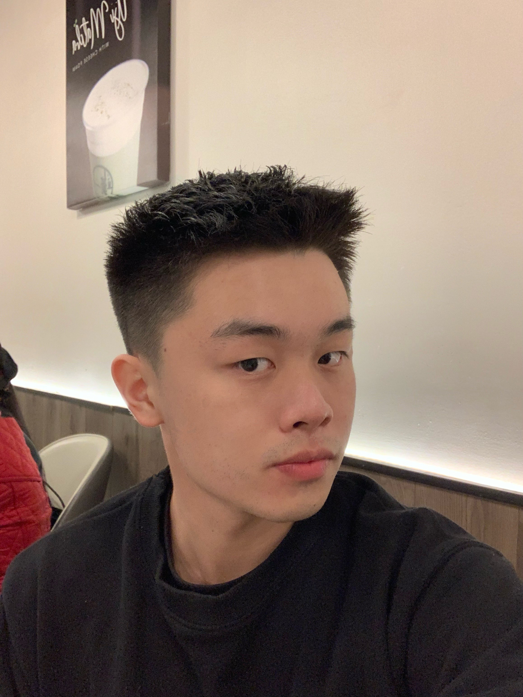

# Zhuoyang Meng's User Page

## Table of Contents
- [Zhuoyang Meng's User Page](#zhuoyang-mengs-user-page)
  - [Table of Contents](#table-of-contents)
  - [My picture](#my-picture)
  - [Introduction](#introduction)
  - [Some other fun facts about me](#some-other-fun-facts-about-me)
  - [Things I look forward to this quarter](#things-i-look-forward-to-this-quarter)
  - [Ending](#ending)

## My picture



## Introduction
Hello everyone! My name is Zhuoyang Meng and I'm a fourth year Applied Math major.

**As a programmer**, I'm familiar with `Java`, `Python`, `C/C++` and know a little bit about the `Spring` framework. I'm particularly into algorithms and design patterns, and in the future I think I'll explore more about machine learning and deep learning.

**As a person**, I come from China and this is my fourth year being in US for college. I like outdoor actvities like hiking and swimming, and I also go to gym very often. Physical pursuits are an important way for me to relax and refresh myself. Besides, I'm also a movie lover and enjoy movies of almost all categories.
My favorite movie is [Interstellar](https://www.imdb.com/title/tt0816692/).

**My life motto:**
>Live each day as if it were your last.

## Some other fun facts about me
1. I love animals.
2. I have two [cats](mycats.JPG).
3. I'm a good singer.

## Things I look forward to this quarter
- [ ] Make new friends in this class
- [ ] Get recommendation letters for grad school application
- [ ] Get good grades

## Ending
In the end, I want to share a piece of code to everyone:

```
if(sad()==true){
  sad().stop();
  beAwesome();
}

```
